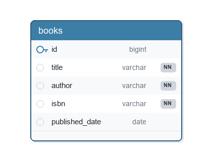

# Book Management Microservice

A simple Book Management microservice built with Java Spring Boot and PostgreSQL. This project demonstrates core backend development skills, including RESTful API design, database integration, and containerization.

## Candidate Information

- **Name:** Taufik Ardiansyah Putra
- **Role Applied:** Junior Java Developer
- **Repository:** `springboot-microservice-task-taufik`

## Tech Stack

- **Framework:** Java Spring Boot (Maven)
- **Database:** PostgreSQL
- **Containerization:** Docker & Docker Compose
- **Version Control:** Git
- **API Testing:** Postman (with environment variables, pre-request scripts, and test scripts)
- **API Documentation:** Swagger UI (SpringDoc OpenAPI)

## Features Implemented (CRUD)

| Method   | Endpoint          | Description                                 |
| :------- | :---------------- | :------------------------------------------ |
| `POST`   | `/api/books`      | Add a new book                              |
| `GET`    | `/api/books`      | Get all books                               |
| `GET`    | `/api/books/{id}` | Get a book by ID                            |
| `PUT`    | `/api/books/{id}` | Update a book by ID (full update)           |
| `PATCH`  | `/api/books/{id}` | Partial update of a book (e.g., title only) |
| `DELETE` | `/api/books/{id}` | Delete a book                               |

## Entity Schema

```json
{
"id": Long,
"title": String,
"author": String,
"isbn": String,
"publishedDate": Date
}
```

## Entity-Relationship (ER) Diagram



The `Book` entity maps to the `books` table with the following columns: `id` (PK, auto-generated), `title` (String, not null), `author` (String, not null), `isbn` (String, not null, unique), and `published_date` (Date).

## API Documentation (Swagger UI)

Once the application is running, access the auto-generated API documentation at:

- **Swagger UI:** `http://localhost:8080/swagger-ui.html`
- **OpenAPI JSON:** `http://localhost:8080/v3/api-docs`
- **OpenAPI YAML:** `http://localhost:8080/v3/api-docs.yaml`

The Swagger UI includes:

- Operation summaries and detailed descriptions for all 6 endpoints
- Request/response schemas with examples
- Documented HTTP status codes (200, 201, 204, 400, 404)
- Try-it-out support for interactive testing

## How to Run the Project

### Prerequisites

- Docker and Docker Compose installed on your machine.
- JDK 17+ (If running locally without Docker).
- Maven (If running locally without Docker).

### Running with Docker Compose (Recommended)

This approach will automatically build the Spring Boot application and spin up the PostgreSQL database container.

1. Clone the repository:

   ```bash
   git clone https://github.com/MidoriNoKen/springboot-microservice-task-taufik.git
   cd springboot-microservice-task-taufik
   ```

2. Build and start the containers:

   ```bash
   docker-compose up -d --build

   ```

3. The application will be accessible at: `http://localhost:8080`

### Environment Variables

This project uses `.env` files for configuration management. A `.env.example` file is provided as a template.

#### Using .env file (Recommended)

1. Copy `.env.example` to `.env`:

   ```bash
   cp .env.example .env
   ```

2. Modify the values in `.env` according to your environment (especially passwords and ports).

3. The `.env` file is automatically loaded by Docker Compose and can be used for local development.

#### Environment Variables Reference

| Variable                     | Description                | Default Value                      |
| :--------------------------- | :------------------------- | :--------------------------------- |
| `POSTGRES_DB`                | PostgreSQL database name   | `bookdb`                           |
| `POSTGRES_USER`              | PostgreSQL username        | `bookuser`                         |
| `POSTGRES_PASSWORD`          | PostgreSQL password        | `bookpass`                         |
| `POSTGRES_PORT`              | PostgreSQL port            | `5432`                             |
| `SPRING_DATASOURCE_URL`      | Spring datasource JDBC URL | `jdbc:postgresql://db:5432/bookdb` |
| `SPRING_DATASOURCE_USERNAME` | Spring datasource username | `bookuser`                         |
| `SPRING_DATASOURCE_PASSWORD` | Spring datasource password | `bookpass`                         |
| `SERVER_PORT`                | Spring Boot server port    | `8080`                             |

**Note:** The `.env` file is included in `.gitignore` and should never be committed to version control for security reasons.

## API Testing & Postman Collection

A Postman collection with environment variables, pre-request scripts, and test scripts is included in this repository to easily test all endpoints.

- **Collection File:** `docs/postman_collection.json`
- **Environment File:** `docs/postman_environment.json`
- **How to use:**
  1. Open Postman -> Click `Import` -> Select both JSON files.
  2. Select the `Book Management API - Local` environment from the environment dropdown.
  3. Run the requests in sequence (POST first to create a book, then GET, PUT, PATCH, DELETE).
  4. Test scripts will automatically validate response status codes and body structure.

## Future Enhancements

While this project focuses on a single microservice, in a real-world scenario, this service could easily be integrated into a larger event-driven architecture (e.g., publishing events via message brokers) and orchestrated using platforms like Kubernetes for automated scaling and resilience.
